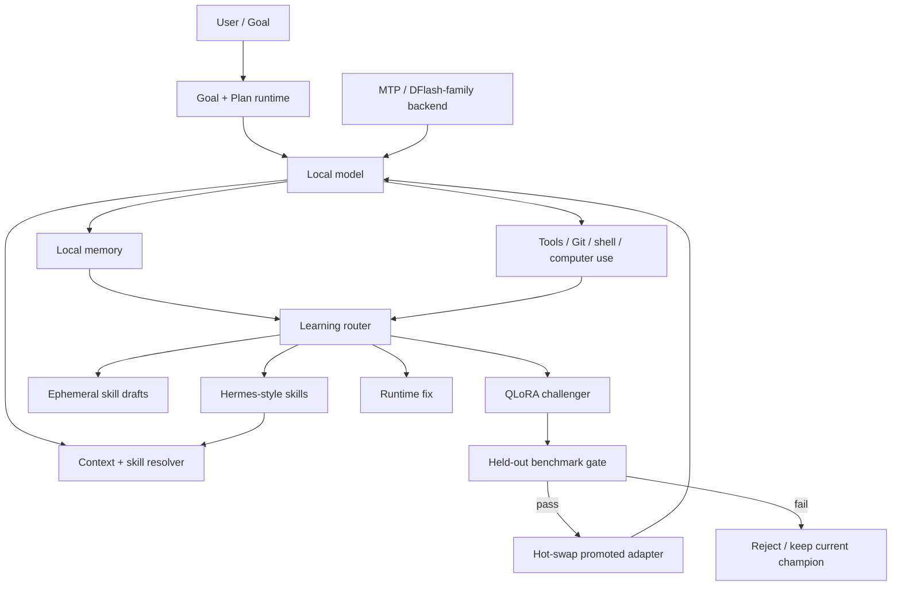

# Unsloth Helix

**A local-first, self-improving agent harness built on top of Unsloth Studio.**

> **Beta / research preview**
>
> Unsloth Helix is still under active development. The agent, memory, self-learning, QLoRA, speculative-decoding, and computer-use paths should be treated as experimental. Expect rough edges, incomplete platform coverage, and behavior changes between commits. Do not rely on this beta for unattended destructive work or production-critical automation without your own validation and permission controls.

Unsloth Helix is an experimental fork of [Unsloth](https://github.com/unslothai/unsloth) that turns the existing local inference and training stack into a persistent coding and research agent. The primary development target is **Qwen3.8-27B on Apple Silicon**, with a Q38-derived long-context runtime profile, durable Goal/Plan execution, local memory, self-improving skills, benchmark-gated QLoRA adaptation, speculative decoding, GitHub-aware workflows, and macOS computer use.

The objective is not to replace Unsloth's core training/inference stack. Helix keeps the upstream stack and adds an agent layer around it. Where a Helix optimization is unavailable or incompatible, the application is expected to fall back to ordinary inference rather than pretend the optimization succeeded.

Current development branch: `codex/unsloth-helix-27b-harness`

## What Helix adds

Unsloth Helix currently adds the following experimental surfaces on top of upstream Unsloth Studio:

- **Persistent Goal and Plan modes** for long-running work rather than one-shot chat.
- **Q38 V1.1-derived runtime policy** for Qwen3.8-27B on macOS, including a 64K automatic context target, unified KV policy, quantized KV defaults, single-slot decode, and larger prefill batches when the profile applies.
- **Speculative decoding lanes** with MTP / DFlash-family support and target-aware fallbacks. The primary automatic Qwen3.8-27B Mac profile uses a target-matched DFlash2 drafter when the selected backend can support it.
- **Local memory** through an optional Mem0 integration plus a bounded local task ledger fallback.
- **Hermes-style procedural learning** that prefers reusable skills before weight updates.
- **On-the-fly skill creation** for recurring procedures, with staged plain-text `SKILL.md` output rather than automatic installation of generated executable code.
- **Self-QLoRA candidate training** with an external promotion gate, benchmark comparison, hot-swap, and rollback.
- **A learning router** that can distinguish between memory, a reusable skill, a runtime repair, QLoRA, or no durable change.
- **Codex / Claude-compatible local skills** and dynamic `/skill-name` commands.
- **GitHub-aware repository context** and a bundled read-only GitHub MCP configuration for Codex workflows.
- **macOS computer use** with screenshot, click, type, key, scroll, and app-opening primitives. Mutating actions are permission-gated.
- **Workspace visibility** for Outputs, Background work, Sources, and Subagents.
- **Measured runtime reporting** through `/speed`, so speculative decoding is distinguished from ordinary target decode.

This is deliberately modular. A feature should be able to fail or be disabled without turning the entire local model into an unusable monolith.

## Why this fork exists

A strong local model is much more useful when the surrounding system removes avoidable work.

Helix is built around a simple idea inherited from the Q38 V1.1 work: **replace expensive modules behind stable interfaces instead of rewriting the whole stack**. That makes individual optimizations measurable, reversible, and easier to kill when they do not help.

The intended operating hierarchy is:

```text
experience
    |
    +--> factual / episodic information ------> local memory
    |
    +--> repeatable procedure ----------------> skill
    |
    +--> novel procedure right now -----------> ephemeral skill draft
    |
    +--> recurring model-level behavior gap --> QLoRA challenger
    |
    +--> infrastructure problem --------------> runtime repair
    |
    `--> noise / one-off ----------------------> learn nothing
```

QLoRA is therefore not the default answer to every failure. The system first asks whether the lesson can be represented more safely and transparently as memory or a skill.

## Architecture



The model can propose a learning action, but it is not the authority that promotes its own QLoRA. Promotion is decided by the external benchmark path.

## Primary target: Qwen3.8-27B on Apple Silicon

The fork is currently optimized around **Qwen3.8-27B on macOS**, especially long-running coding/research sessions where time-to-first-action, warm-turn latency, prefix stability, and context handling matter more than a single headline tokens-per-second number.

When automatic settings are in use, the current V1.1 profile targets:

- 64K context;
- unified KV;
- `q4_0` KV where the backend supports the profile;
- single-slot decode;
- larger prefill batches;
- target-matched DFlash2 selection where compatible.

Explicit user settings remain authoritative. A user-selected context length, cache type, slot count, speculative mode, or placement choice should not be silently overwritten by an automatic profile.

A runtime fit reduction is an observed hardware outcome, not new user intent. Helix should not persist a temporary fit-reduced value as though the user requested it.

See [`docs/UNSLOTH_27B_MAC_HARNESS.md`](docs/UNSLOTH_27B_MAC_HARNESS.md) for the current detailed runtime and learning contract.

## Speculative decoding

Helix exposes speculative decoding as an optimization layer, not as a quality shortcut.

The current code contains experimental MTP and DFlash-family paths, including MLX speculative support. A compatible speculative run must still be verified by the target model. If a drafter cannot load or a target/backend pair is unsupported, ordinary decoding remains available and the fallback should be visible.

Do not interpret the existence of a speculative mode as a universal speed claim. Real speedup depends on:

- target model and quantization;
- drafter/target match;
- acceptance length;
- prompt/context length;
- backend implementation;
- memory bandwidth and available unified memory;
- verification overhead;
- workload shape.

A speed multiplier is evidence-backed only when the runtime actually reports an active speculative path and accepted draft tokens. The fork intentionally does **not** claim a universal 2x, 5x, or similar multiplier.

For Qwen3.8-27B, the automatic Mac profile prefers the target-matched DFlash/DFlash2 path available to the selected backend. Unsupported DFlare or mismatched checkpoints should not be guessed into existence.

## Memory

Memory is optional and local-first.

Helix currently supports two layers:

1. a bounded local task/experience ledger that remains available without extra packages;
2. optional Mem0-backed retrieval for longer-lived recurrence and project context.

The current Mem0 adapter is designed around account-scoped local storage:

- Qdrant files and history live under the account's local `learning/mem0` directory;
- the vector-store user id is a one-way account hash rather than an email/account subject;
- embeddings use a local Hugging Face model;
- the Mem0 LLM points at Studio's local OpenAI-compatible endpoint by default;
- Mem0 and Hugging Face telemetry are disabled by the adapter;
- if Mem0 is unavailable, the bounded JSON ledger remains the fallback.

Install the optional memory dependency in a compatible environment with:

```bash
pip install 'mem0ai>=0.1.118,<1.0'
```

or, when installing this repository as a Python package:

```bash
pip install -e '.[studio,memory]'
```

Memory can contain sensitive project information. Local-first storage reduces exposure; it does not remove the need to decide what the agent is allowed to remember.

## Self-improving skills

Procedural learning is preferred over weight updates when the behavior can be expressed as an inspectable workflow.

The intended learning ladder is:

```text
experience -> memory retrieval -> repeated pattern -> skill -> proven model deficiency -> QLoRA
```

A recurring procedure can be staged as a plain-text `SKILL.md`. Helix can also surface installed Codex/Claude skills and make them available through dynamic slash commands.

Current local commands include:

```text
/github [query]      inspect connected GitHub/repository context
/plan [objective]    enter durable Plan mode
/goal [objective]    enter durable Goal mode
/speed               report measured inference/runtime state
/learn               open or invoke the learning path
/skills              show installed/local skills
/skill-name request  invoke a discovered skill
```

Skill installation is intentionally data-oriented: installing a skill should not execute arbitrary repository scripts.

## On-the-fly skill creation

Helix can draft a new skill while working when it encounters a procedure that appears reusable.

The current path is conservative:

1. a task completes;
2. the model can emit a hidden/staged skill proposal;
3. local recurrence evidence is checked;
4. the proposal remains a candidate until accepted;
5. approval writes a plain `SKILL.md`;
6. generated executable code is not automatically installed as part of the skill.

This creates a fast adaptation layer without immediately changing model weights.

## Self-QLoRA and hot-swap

QLoRA is the highest-risk learning tier in the current design and is benchmark-gated.

The model may recommend QLoRA when it identifies a recurring behavioral deficiency that cannot be solved cleanly with memory, a skill, or a runtime repair. It cannot promote itself merely by saying the new adapter is better.

The current acceptance contract requires an external comparison between the incumbent and candidate. The present implementation includes:

- a fixed held-out benchmark;
- deterministic scoring paths;
- candidate versus incumbent comparison;
- a minimum intelligence improvement threshold;
- throughput measurement with no accepted regression;
- preservation of the original base/current champion;
- promotion by hot-swapping only a validated PEFT adapter;
- rejection/rollback when the candidate fails.

The current harness guide records a minimum candidate intelligence improvement of `0.01` for its acceptance gate. That threshold is part of the present beta implementation, not a claim that it is universally optimal.

Self-training is still experimental. A benchmark gate reduces self-poisoning risk; it does not prove broad generalization. Keep sealed or otherwise uncontaminated evaluation data outside the training/model-selection path when using this mechanism seriously.

## Goal and Plan modes

Helix separates the desired outcome from the execution path.

- **Goal mode** stores the concrete outcome the agent is trying to achieve.
- **Plan mode** stores the durable sequence of work used to reach it.

The intent is to make long sessions survive ordinary turn boundaries and thread restoration without requiring the model to rediscover the entire objective on every request.

The UI includes goal progress and plan/workspace surfaces so the user can observe what the agent believes it is doing instead of reconstructing state from a terminal scrollback.

## GitHub and local coding workflows

The fork includes a local Codex-oriented plugin under:

```text
plugins/unsloth-local-codex/
```

It provides:

- a reusable `SKILL.md` contract for local coding/research work;
- a read-only GitHub MCP configuration;
- durable Goal/Plan expectations;
- evidence-oriented rules for inference/runtime changes.

`/github` can resolve configured GitHub context and local remotes so the agent can inspect repository state without requiring the user to paste a repository URL every time.

The bundled GitHub MCP configuration is read-only by design. Credentials should remain in the MCP/OAuth host rather than being copied into prompts, logs, or the repository.

## Computer use

The current computer-use primitive is **macOS-only**.

Supported actions include:

- screenshot;
- click;
- type;
- key presses;
- scroll;
- open application.

Screenshot is read-only. Mutating actions are marked approval-required by the tool policy and use bounded native macOS automation APIs.

To use computer control, grant the application Accessibility permission:

```text
System Settings -> Privacy & Security -> Accessibility
```

Computer use is powerful. Keep approval controls enabled until you have validated the exact workflow you want to automate.

## Permissions and learning controls

The current UI separates ordinary conversation from learning/automation authority.

The fork exposes an Ask-me versus Autonomous decision mode and independent controls for operations such as:

- skill creation;
- QLoRA training;
- runtime repair;
- Mem0 usage;
- computer-use actions.

The exact control surface is still beta and may move. The design principle is stable: **ability to perform an action and permission to perform it are separate concerns.**

## Workspace UI

The chat workspace includes additional surfaces intended for long-running agent work:

- **Outputs** — user-visible/generated work;
- **Background** — longer-running activity/state;
- **Sources** — evidence and source context;
- **Subagents** — delegated/parallel work surfaces.

The goal is a stable GUI around an autonomous local worker rather than a conventional stateless chat window.

## Quick start

### Important: this beta is source-first

At the moment, the Helix development line lives on the branch in this fork. Upstream Unsloth download links install **upstream Unsloth**, not this Helix branch. Do not use an upstream release binary and assume it contains the features described here.

Clone the fork and select the Helix branch:

```bash
git clone https://github.com/SuperHelix77/unsloth.git
cd unsloth
git checkout codex/unsloth-helix-27b-harness
```

For the Python/Studio environment, a development install can use the repository extras:

```bash
python -m venv .venv
source .venv/bin/activate
python -m pip install --upgrade pip
pip install -e '.[studio,memory]'
```

If you do not want Mem0 yet:

```bash
pip install -e '.[studio]'
```

The frontend source in this branch contains the Helix UI changes. Build it before expecting a source-run Studio instance to reflect those changes:

```bash
cd studio/frontend
npm ci
npm run build
cd ../..
```

Then start Studio through the existing Unsloth CLI:

```bash
unsloth studio
```

The project inherits upstream Unsloth's native backend requirements and platform-specific setup. If a local backend dependency is missing, follow the corresponding upstream Unsloth development/install guidance rather than forcing a Helix optimization through an unsupported runtime.

### Native desktop development

The desktop shell is Tauri-based. The current fork identifies the beta desktop build as `Unsloth V1.1` internally while the project name and README use **Unsloth Helix**. Branding/package cleanup is still part of the beta work.

For desktop development, install the upstream Tauri/Rust/Node prerequisites first. The frontend currently requires Node:

```text
^20.19.0 or >=22.12.0
```

Use the repository's existing Tauri/upstream development workflow to build a native app. A successful source/backend test run alone is not evidence that the installed desktop bundle changed; build the desktop app before validating desktop-only behavior.

## Suggested Qwen3.8-27B workflow

A typical target setup is:

1. load a Qwen3.8-27B model supported by the selected backend;
2. leave runtime settings on automatic if you want the V1.1 Mac profile;
3. verify the resolved context/cache settings rather than assuming they applied;
4. use `/speed` to distinguish target decode from active speculative decoding;
5. use Goal mode for the outcome and Plan mode for durable execution;
6. enable memory only if you want cross-task recurrence;
7. keep skill creation / QLoRA / computer-use permissions conservative until validated;
8. benchmark any promoted QLoRA candidate against the incumbent before accepting it.

For long coding sessions, task wall time and warm-turn latency matter more than raw decode throughput alone. Measure the whole agent loop.

## Benchmarking philosophy

This fork is intentionally hostile to vague speed claims.

When comparing Helix with another runtime or with the incumbent adapter, capture at least:

- time to first useful action;
- warm-turn TTFT;
- prefill/context processing time;
- target decode tokens/s;
- speculative accepted tokens / acceptance length where applicable;
- tool-result-to-next-action latency;
- total task wall time;
- task success / tests passed;
- model calls and tool calls;
- peak memory / unified-memory pressure;
- adapter/skill/memory state used for the run.

For self-learning changes, quality must not be replaced by economy. A cheaper run that breaks the task is not an optimization.

## Beta limitations

Known or intentional limitations of the current development line include:

- **Beta status:** APIs, UI placement, stored schemas, and learning behavior may change.
- **Primary optimization target is macOS + Qwen3.8-27B.** Other upstream Unsloth model/backend paths remain available, but Helix-specific optimization coverage is not uniform.
- **Computer use is macOS-only** in the current implementation.
- **Mem0 is optional** and can be unavailable in an otherwise working Studio install.
- **Speculative decoding is workload-dependent** and may provide little or no speedup for a particular target/drafter/backend combination.
- **DFlare should not be inferred from a DFlash path.** Target-specific support must exist and be measured.
- **Self-QLoRA is experimental.** A passing local gate is not proof of broad intelligence improvement.
- **On-the-fly skills are deliberately conservative** and currently persist plain-text instructions rather than arbitrary generated executables.
- **Helix Engine feedback integration is not part of this beta yet.** It is a future integration target, not a current feature claim.
- **No universal performance multiplier is claimed.** Publish measurements with model, quant, context, backend, and hardware scope.
- **The fork currently follows an upstream-heavy codebase.** Rebase/merge work can change surrounding implementation details quickly.

## Safety and privacy

Helix is designed to run locally, but local does not mean harmless.

- Shell/file tools can change repositories and local data.
- Computer use can operate desktop applications once macOS permissions are granted.
- Memory can retain information that you did not intend to keep indefinitely.
- Autonomous skill or QLoRA workflows can encode bad behavior if evaluation is weak.
- A local agent with broad filesystem, GitHub, or application permissions should be treated like any other automation account with those privileges.

Use least-privilege permissions, keep important work under version control, and preserve rollback paths.

## Testing

The Helix branch adds backend and frontend regression coverage for the new surfaces, including tests for:

- Q38 V1.1 policy;
- speculative MLX behavior;
- self-training/QLoRA routes;
- learning routing;
- Mem0 storage behavior;
- GitHub context;
- macOS computer use;
- durable Goal/Plan state;
- local skills and Hermes-style learning;
- Qwen context policy.

Useful developer checks include the repository's existing Python tests plus frontend build/type/test checks. For the frontend:

```bash
cd studio/frontend
npm test
npm run typecheck
npm run build
```

A passing unit suite is necessary but not sufficient for release claims. Runtime performance and self-learning behavior need end-to-end measurements on the actual target model/hardware.

## Project status

Current status: **Beta / active research and integration**.

The feature set has moved beyond a simple inference wrapper, but the project has not yet earned a stable release label. Before a stable release, the intended bar is:

- reproducible source build;
- clean permission boundaries;
- regression-tested memory/skill/QLoRA state transitions;
- repeatable Qwen3.8-27B Mac benchmark results;
- failure-safe speculative fallback;
- adapter rollback validation;
- computer-use permission/error validation;
- clear upgrade/migration behavior for persisted state;
- release packaging that no longer depends on upstream binaries for Helix-specific features.

## Relationship to upstream Unsloth

Unsloth Helix is an **independent experimental fork** of the Unsloth project. It is not an official Unsloth release and should not be presented as endorsed by Unsloth AI.

The fork intentionally preserves the underlying Unsloth training/inference platform and upstream history. Generic model support, training features, deployment paths, and a large amount of Studio functionality come from upstream Unsloth.

Upstream project and documentation:

- https://github.com/unslothai/unsloth
- https://unsloth.ai/docs

When a problem reproduces on unmodified upstream Unsloth, report it upstream where appropriate. Helix-specific agent, memory, learning, QLoRA, computer-use, or runtime-policy issues belong to this fork.

## Licensing and attribution

This fork preserves upstream licensing and notices.

At the time of this branch:

- core files under `unsloth/*`, tests, and scripts are covered by the upstream Apache-2.0 licensing terms described in the repository `LICENSE`;
- `studio/*` and `unsloth_cli/*` are covered by the upstream AGPLv3 terms; see [`studio/LICENSE.AGPL-3.0`](studio/LICENSE.AGPL-3.0);
- modified files must continue to comply with the applicable upstream license and attribution requirements.

The **Unsloth** name, logos, and trademarks belong to their respective owners. This fork's use of the upstream project name describes its origin and compatibility; it does not imply endorsement.

## Contributing

This is still a fast-moving beta. High-value contributions are those that preserve measurable behavior and clean fallback boundaries.

When proposing a change:

1. identify the exact module/policy being replaced;
2. keep explicit user settings authoritative;
3. add a regression test before or with the wiring change;
4. measure the target workload rather than extrapolating a paper's best case;
5. keep a kill switch or ordinary-decoding fallback where practical;
6. report quality, latency, and memory effects separately;
7. do not promote a self-learning candidate on its own self-evaluation.

For performance work, include model, quantization, backend, context, hardware, and the metric definition used.

## Acknowledgements

Unsloth Helix exists because of the substantial work in upstream Unsloth and its contributors. The fork also draws architectural ideas from local-agent and self-improvement systems such as Codex/Claude-style skills, Hermes-style procedural learning, Mem0-style memory, and speculative decoding research. Those references describe architectural inspiration; they do not imply endorsement or identical implementations.

The Qwen3.8-27B Mac runtime profile and replacement-oriented optimization philosophy were developed from the Q38 V1.1 experimentation line and adapted here as modular policy rather than as a claim that every Q38 mechanism belongs in Unsloth.

---

**Unsloth Helix is beta software. Measure it, break it, keep the evidence, and do not confuse an optimization being available with it being proven.**
