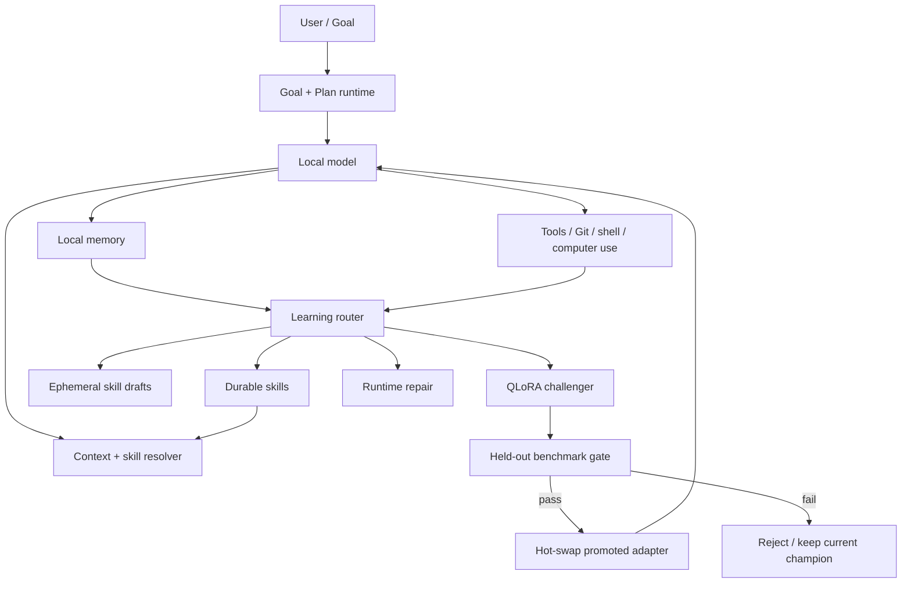

# Unsloth Helix

**A local-first, self-improving agent harness built on top of Unsloth Studio.**

> **Beta / research preview**
>
> Unsloth Helix is under active development. The agent, memory, self-learning, QLoRA, speculative-decoding, and computer-use paths are experimental. Expect rough edges, incomplete platform coverage, and behavior changes between commits. Do not use this beta for unattended destructive work or production-critical automation without your own validation, backups, and permission controls.

Unsloth Helix is a community fork of [Unsloth](https://github.com/unslothai/unsloth) that turns the existing local inference and training stack into a persistent coding and research agent.

The primary development target is **Qwen3.8-27B on Apple Silicon**. Helix combines a Mac-focused long-context runtime profile with durable Goal/Plan execution, local memory, self-improving skills, benchmark-gated QLoRA adaptation, speculative decoding, GitHub-aware workflows, and macOS computer use.

The repository is intended to be understandable and usable on its own. No separate private research repository is required to understand the architecture or operate the public Helix features.

Current development branch: `codex/unsloth-helix-27b-harness`

## What Helix adds

Helix currently adds these experimental capabilities on top of upstream Unsloth Studio:

- **Persistent Goal and Plan modes** for long-running work instead of one-shot chat.
- **Helix 27B Mac runtime profile** for Qwen3.8-27B, including a 64K automatic context target, unified-memory-aware settings, quantized KV defaults, single-slot decode, and larger prefill batches when the profile applies.
- **Speculative decoding lanes** with MTP and DFlash-family support, target-aware selection, and ordinary-decoding fallback when a compatible accelerator is unavailable.
- **Local memory** through optional Mem0 integration plus a bounded local task-ledger fallback.
- **Hermes-style procedural learning** that prefers reusable skills before model-weight updates.
- **On-the-fly skill creation** for recurring procedures, staged as inspectable plain-text `SKILL.md` files.
- **Self-QLoRA candidate training** with external benchmark comparison, hot-swap, rejection, and rollback.
- **A learning router** that can choose between memory, a reusable skill, a runtime repair, QLoRA, or no durable change.
- **Codex / Claude-compatible local skills** and dynamic `/skill-name` commands.
- **GitHub-aware repository context** and a bundled read-only GitHub MCP configuration for Codex workflows.
- **macOS computer use** with screenshot, click, type, key, scroll, and app-opening primitives. Mutating actions are permission-gated.
- **Workspace visibility** for Outputs, Background work, Sources, and Subagents.
- **Measured runtime reporting** through `/speed`, so speculative decoding is distinguished from ordinary target decode.

The design is intentionally modular. A feature should be independently disableable, measurable, and replaceable without turning the whole local-model stack into a monolith.

## Design philosophy

Helix follows a simple rule: **replace expensive or limiting modules behind stable interfaces instead of rewriting the entire system**.

That gives every optimization a clean baseline, a kill switch, and a measurable effect. If a faster path is unsupported or fails, Helix should preserve a working ordinary path rather than hide the fallback or claim an unmeasured speedup.

The same principle is used for learning. Not every mistake deserves weight updates:

```text
experience
    |
    +--> factual / episodic information ------> local memory
    |
    +--> repeatable procedure ----------------> durable skill
    |
    +--> novel procedure needed now ----------> ephemeral skill draft
    |
    +--> recurring model-level behavior gap --> QLoRA challenger
    |
    +--> infrastructure problem --------------> runtime repair
    |
    `--> noise / one-off ----------------------> learn nothing
```

## Architecture



The model may propose a learning action, but durable promotion is not supposed to depend on the model simply declaring itself better.

## Qwen3.8-27B Mac profile

On supported macOS configurations, Helix provides an automatic profile aimed at keeping a large local coding agent responsive under unified-memory constraints.

The current automatic profile targets:

- 64K context when the model and available memory permit it;
- unified-memory-aware KV handling;
- quantized KV defaults;
- single-slot decode for the intended interactive-agent workload;
- larger prefill batches where supported;
- target-matched speculative decoding when a compatible drafter/backend is available.

**Explicit user settings remain authoritative.** Automatic policy must not silently overwrite an explicit context length, cache type, slot count, placement choice, or speculative-decoding mode.

A runtime fit reduction is a runtime outcome, not a new persistent user preference.

See [`docs/UNSLOTH_27B_MAC_HARNESS.md`](docs/UNSLOTH_27B_MAC_HARNESS.md) for the current profile and learning details.

## Speculative decoding

Helix treats speculative decoding as an optional acceleration layer rather than a correctness shortcut.

Supported/experimental lanes include:

- ordinary target-only decoding;
- native MTP where the model/backend supports it;
- DFlash-family drafting where the target/drafter pair is compatible.

Accepted speculative tokens are still verified by the target model. Real speedup depends on hardware, quantization, context length, acceptance rate, drafter cost, and backend implementation.

A performance claim is considered meaningful only when the runtime can show that speculative decoding was actually active and accepted draft tokens were committed. Helix should never turn a paper's or checkpoint author's best-case multiplier into a universal local claim.

## Persistent goals and plans

Helix adds durable execution state around normal chat.

- **Goal mode** represents the concrete outcome the agent is trying to achieve.
- **Plan mode** stores the execution plan and progress toward that outcome.
- State can survive ordinary chat turns instead of forcing the model to reconstruct the task from scratch every time.
- Workspace surfaces expose outputs, background activity, sources, and subagent work.

The intended loop is:

```text
goal -> inspect -> plan -> act -> observe -> verify -> update plan -> continue/stop
```

The agent should stop when the goal is complete, blocked, permission-gated, or requires a decision outside its configured authority.

## Skills and procedural learning

Helix can discover and use portable `SKILL.md` instructions compatible with local Codex/Claude-style workflows.

Relevant commands include:

- `/skills` — show available skills;
- `/skill-name request` — load a selected skill for the current request;
- `/plan [objective]` — switch to durable Plan mode;
- `/goal [objective]` — switch to durable Goal mode;
- `/github [query]` — use configured GitHub context;
- `/speed` — report measured inference/runtime information;
- `/learn` — open or invoke the learning workflow where available.

Helix can also propose new skills while working. Generated skills are staged as plain text and are intended to remain inspectable and reversible. The public skill path does **not** silently install arbitrary generated executable code.

Procedural knowledge belongs in skills; project facts belong in memory. Keeping those responsibilities separate helps prevent a large opaque prompt from becoming the real application state.

## Local memory

Mem0 support is optional. When available, Helix configures it for local, account-scoped use:

- Qdrant data/history under the account learning directory;
- a one-way account identifier rather than an email/account subject as the vector-store user id;
- local embeddings;
- the local Studio OpenAI-compatible endpoint as the default memory LLM path;
- telemetry disabled by the adapter where supported.

If Mem0 is unavailable, the bounded local JSON/task ledger remains usable.

Optional dependency:

```bash
pip install 'mem0ai>=0.1.118,<1.0'
```

The application should not silently downgrade the rest of the environment merely to satisfy an optional memory dependency.

## Self-QLoRA and hot-swap

QLoRA is the highest-risk learning tier and is therefore benchmark-gated.

The current intended promotion flow is:

```text
observed recurring deficiency
        |
        v
candidate training set
        |
        v
QLoRA challenger
        |
        v
held-out benchmark versus current baseline/champion
        |
   +----+----+
   |         |
 pass       fail
   |         |
 hot-swap   reject
   |         |
 rollback target remains available
```

The gate is external to the candidate model. Current policy requires deterministic held-out comparison, measurable quality improvement, and no throughput regression under the configured benchmark policy before automatic promotion.

A model critique or self-score alone is not evidence of improvement.

Because adapters are separate from the base model, a promoted adapter can be hot-swapped and rolled back without destructively rewriting the base checkpoint.

## GitHub-aware workflows

The bundled local Codex plugin provides a read-only GitHub MCP configuration for repository, issue, pull-request, and source inspection.

Helix can also use authenticated/local Git context through `/github` where configured. Credentials should remain in the connector/host; they should not be copied into prompts, logs, skills, or repository files.

Repository evidence should retain useful provenance such as file paths and commits whenever the agent is making implementation or benchmark claims.

## Computer use

The current computer-use implementation is **macOS-only and experimental**.

Available primitives include:

- screenshot;
- click;
- typing;
- key presses;
- scrolling;
- opening an application.

Screenshot is read-only. Mutating UI actions are permission-gated by the local tool policy. macOS Accessibility permission is required for automation actions.

Enable it in:

`System Settings -> Privacy & Security -> Accessibility`

Computer use is intentionally a bounded primitive, not a hidden shell escape.

## Permissions

The learning controls expose separate permission decisions for operations such as:

- skill creation;
- QLoRA training/promotion;
- runtime repair;
- Mem0 usage;
- computer-use actions.

The goal is to allow ordinary local chat to remain convenient while keeping higher-impact self-modification and UI actions explicit.

## Installation

### Important: upstream binaries are not Helix builds

The release installers linked by the upstream Unsloth project install **upstream Unsloth**, not this experimental Helix branch.

Until Helix publishes its own signed beta artifacts, use the source branch if you want the Helix features:

```bash
git clone https://github.com/SuperHelix77/unsloth.git
cd unsloth
git checkout codex/unsloth-helix-27b-harness
```

Then use the repository's normal Unsloth Studio development/build workflow for your platform.

The project deliberately does not advertise an upstream release artifact as a Helix binary.

## Development and validation

Helix changes should be evaluated against the unmodified/upstream behavior they replace.

Useful validation dimensions include:

- time to first useful action;
- warm-turn latency;
- prefill/context-processing time;
- committed decode throughput;
- speculative acceptance rate;
- peak memory / unified-memory pressure;
- completed-task wall time;
- task/test success;
- tool-call count;
- regression rate after a learned skill or QLoRA candidate;
- rollback behavior.

For source changes, use the relevant backend/frontend tests and build checks from the repository. The Helix branch includes focused tests for the Mac profile, speculative decoding, memory, learning, self-training, computer use, GitHub context, goals, and local skills.

## Benchmarking philosophy

Helix is designed around **measured improvement, not feature-count improvement**.

A candidate optimization should answer four questions:

1. Did the task still succeed?
2. Did it actually reduce latency, compute, memory, or repeated work?
3. Did it introduce a regression elsewhere?
4. Can it be disabled or rolled back cleanly?

Self-learning follows the same rule. A new skill or adapter should not become permanent merely because it was generated successfully.

## Current limitations

This is a beta. Known limitations include:

- the optimized development target is currently Qwen3.8-27B on Apple Silicon;
- computer use is currently macOS-specific;
- speculative-decoding support depends on the exact backend and target/drafter compatibility;
- DFlash-family acceleration can fall back to ordinary decoding;
- Mem0 is optional and may be unavailable in some installed environments;
- QLoRA training/promotion remains experimental and should be treated as a reversible candidate process;
- skill generation and procedural learning still require more long-horizon qualification;
- platform coverage outside the primary Mac target is not yet equivalent;
- benchmark results from one machine/model/context should not be generalized to every installation.

## Safety and privacy

Helix is local-first, but local execution is still execution.

- Review tool permissions before enabling autonomous operation.
- Keep backups or Git history before allowing the agent to edit valuable work.
- Treat computer-use actions as potentially destructive even when the model is local.
- Do not put access tokens or secrets into skills, prompts, or logs.
- Keep self-training datasets separate from held-out promotion benchmarks.
- Preserve rollback paths for learned adapters and durable skills.

## Relationship to upstream Unsloth

Unsloth Helix is an experimental community fork. It is **not an official Unsloth AI release** and should not be represented as one.

The fork intentionally keeps upstream Unsloth's inference, training, Studio, installer, and model-support work wherever possible, while adding an experimental agent/learning layer.

Upstream project: <https://github.com/unslothai/unsloth>

Upstream documentation: <https://unsloth.ai/docs>

## Licensing

This repository inherits Unsloth's split licensing model. Check the license applicable to the files you modify or redistribute.

In particular, the Studio surface is covered by the repository's AGPL license file, while other upstream portions use the licensing documented by Unsloth. Preserve upstream copyright, license, attribution, and modification notices when redistributing the fork.

## Credits

Unsloth Helix builds on the work of the upstream Unsloth project and the broader open-source ecosystem around local inference, PEFT/QLoRA, speculative decoding, Mem0, portable agent skills, and autonomous coding agents.

The Helix-specific goal is to make those mechanisms compose into a measurable, reversible local agent rather than to hide their origins behind a new monolith.

---

**Status: beta. Expect rapid changes. Benchmark before trusting an optimization, and keep a rollback path.**
